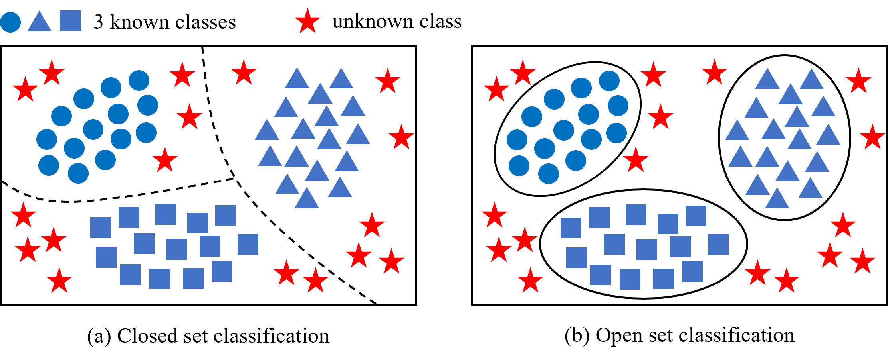

# Open Set Classification for Signal Diagnosis of Machinery Sensor in Industrial Environment  

This repository provides implementations for our [paper](https://ieeexplore.ieee.org/document/9763052/):

> **J. Chen, G. Wang, J. Lv, Z. He, T. Yang and C. Tang, "Open Set Classification for Signal Diagnosis of Machinery Sensor in Industrial Environment," in IEEE Transactions on Industrial Informatics, doi: 10.1109/TII.2022.3169459.**

## Abstract
Most data-driven signal diagnosis methods are based on closed set assumption that class sets of training and test data are consistent. However, in industrial scenarios, during the running process of the device, the operating environment and condition may change over time, continuing generating data belong to unknown classes with new characteristics and distribution. The unknown classes usually reflect new modes or faults of the device need to be captured. They are unavailable in training phase, contradicting the closed set assumption. Existing methods are inappropriate to this type of open set classification requiring to classify known classes and recognize unknown classes. To address this challenging problem, this paper proposes a generic open set signal classification method. First, we apply Fourier transform to convert the sensor signals from time domain to frequency domain, then data in the time and frequency domains are fused. Next, a variational encoder-classifier network is proposed to classify known classes and learn the distribution of feature space to extract robust latent features. Finally, based on extreme value theory and entropy, a pair of discriminators determine whether samples belong to unknown or not. The experimental results on two vibration signal datasets from bearings and nuclear reactor demonstrate the effectiveness and superiority of our proposed open set signal classification method, especially in practical applications.



In the open set scenario, based on the assumption that some classes are unknown in the training set, for each class the algorithm determines a finite region associated with it. If a sample lies in a region of the known class, it is identified to that class. On the other hand, if it lies in a space that is not associated with any known class, it is rejected as an unknown class.

## Requirements and Dependencies

Here we only list our used requirements and dependencies.

* libmr: 0.1.9
* matplotlib: 3.3.3
* numpy: 1.19.3
* scikit_learn: 0.23.2
* scipy: 1.5.4
* seaborn: 0.11.0
* torch: 1.7.1
* torchvision: 0.8.2

They can be installed with:

```
pip install -r requirements.txt
```

## Datasets Preparation

This repository uses the bearing data from Case Western Reserve University, which can be downloaded at https://engineering.case.edu/bearingdatacenter.

Put the training set (known classes) on `./code/datasets/known/CWRU***/{train|test}`. The *** means the labels of known classes, e.g., "0147" means task C8 in the paper.

All of the open set test set(known classes) should be put on `./code/datasets/openset/xxx`. The xxx means the name of classes, e.g., Normal.

## Training

The model can be trained using the `main.py` program:

	python3 main.py

The details of command line parser can be shown with adding the `--help`.

## Testing the performance of open set recognition

The model can be trained using the `test_openset.py` program.

	python3 test_openset.py
	
The `--resume "path"` option specifies the path of a pre-trained model, which is required. In addition, the command line parser associated with the model need to be consistent with those used during training.

## Citation

If you find our work and this repository useful. Please consider giving a star and citation.

Bibtex:
```
@ARTICLE{ossc,
         author={Chen, Jianming and Wang, Guangjin and Lv, Jiancheng and He, Zhenan and Yang, Taibo and Tang, Chenwei},
         journal={IEEE Transactions on Industrial Informatics},
         title={Open Set Classification for Signal Diagnosis of Machinery Sensor in Industrial Environment},
         year={2022},
         doi={10.1109/TII.2022.3169459}}
```